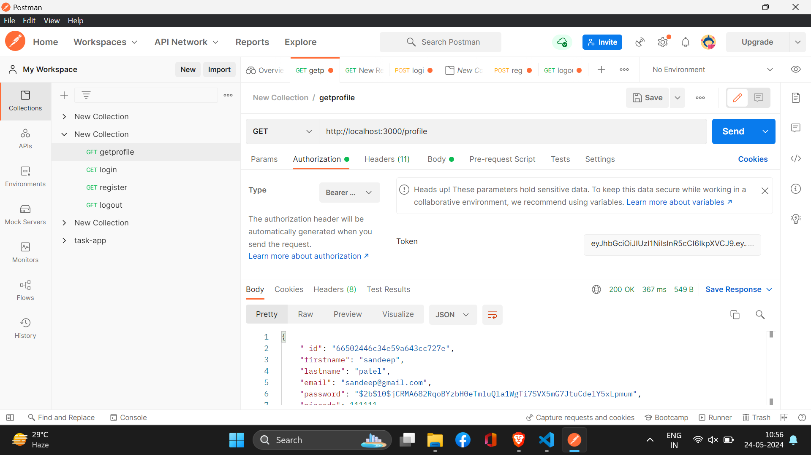

# Lens

## Running the Code Locally on your machine

To set up the project locally on your machine, follow these steps:

1. Clone the repository:

   ```
   git clone https://github.com/sandeeppatel2001/Lens
   ```

2. First Navigate to the Lens directory

```
cd Lens
```

3. Install dependencies:

   ```
   npm install
   ```

4. Start the development server:

   ```
   npm start
   ```

5. The server is running on 3000 port.

## main Api

- http://localhost:3000/register For register new User.
- http://localhost:3000/login For Login and return a Token.
- http://localhost:3000/profile For get Profile details but you have to provide Token which you got during Login.
- http://localhost:3000/logout For logout but you have to provide Token which you got during Login.

---

## Start Swagger For API Testing

1. First start the server
2. Then Open Browser and Navigate to http://localhost:3000/swagger
   
   3.From here you can test every api key

## Swagger Testing Output

### For /register


### For /login


### For /profile


### For /Logout


---

## Test Result Through Postman

### For /register


### For /login


### For /profile



### For /Logout


---

## Test Result From Unit(Mocha and Chai) Testing Result

### Command for Unit test

```
npm test
```


### If you encounter any issues or have questions, feel free to reach out for assistance.

**Contact Information:**

- Gmail: sandeepkrpatel2002@gmail.com


---

**Author:** Sandeep Patel
